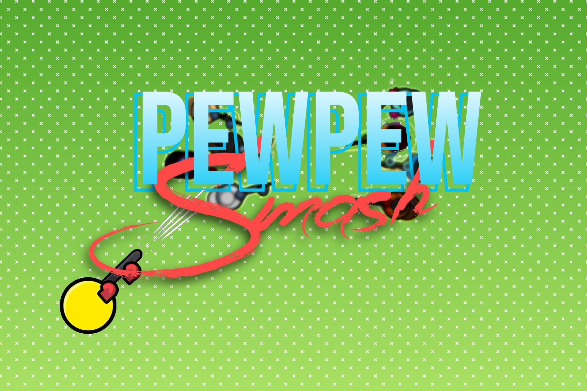
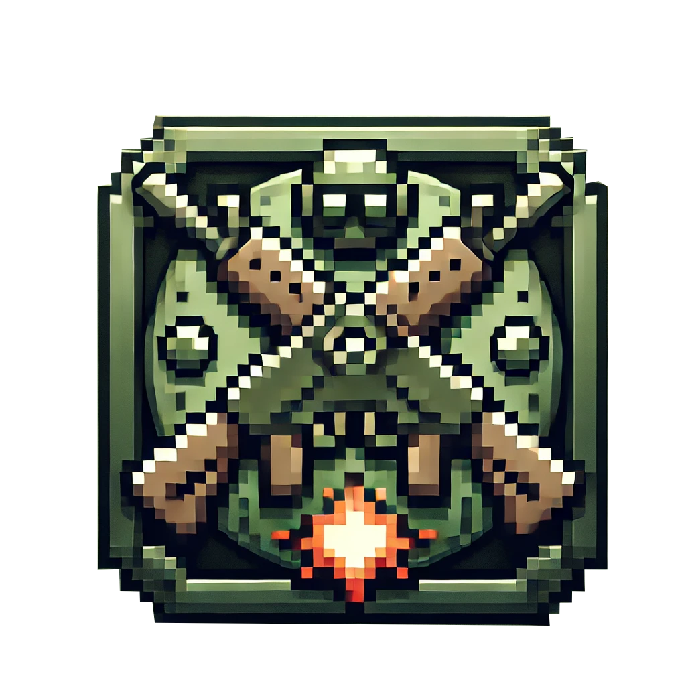

## Disclaimer ⚠️ 

If you want to use your own database the script.sql is provided and you will need to create DatabaseConfig.json in the config folder. You do not need to use a database if you don't want to be able to connect.


# PewPewSmash
<div align="center">
  
  
  [](https://www.oracle.com/java/)
  [](https://github.com/T1WiLLi/PPS)
  [](LICENSE)
  
  🎮 A fast-paced 2D multiplayer combat game with procedural worlds and diverse weapons 🎮
</div>

PewPewSmash is an action-packed 2D multiplayer Java game that combines intense combat mechanics with procedural world generation. Built with Kryonet networking, the game offers seamless multiplayer experiences with easy server hosting capabilities. Whether you're engaging in close-quarters combat or strategic long-range battles, PewPewSmash delivers an engaging and dynamic gameplay environment.

## ✨ Key Features

<div style="display: grid; grid-template-columns: repeat(2, 1fr); gap: 20px;">
  <div>
    <h3>🌐 Seamless Multiplayer</h3>
    <ul>
      <li>Built-in server hosting capabilities</li>
      <li>Automatic UPnP port forwarding</li>
      <li>Low-latency networking with Kryonet</li>
      <li>Easy join & play functionality</li>
    </ul>
  </div>
  <div>
    <h3>🎮 Gameplay Features</h3>
    <ul>
      <li>Real-time combat system</li>
      <li>Various weapon types and combat styles</li>
      <li>Procedurally generated worlds</li>
      <li>Spectator mode with player switching</li>
    </ul>
  </div>
  <div>
    <h3>⚔️ Combat System</h3>
    <ul>
      <li>Melee and ranged weapon varieties</li>
      <li>Customizable weapon attributes</li>
      <li>Dynamic bullet physics</li>
      <li>Strategic combat mechanics</li>
    </ul>
  </div>
  <div>
    <h3>⚙️ Customization</h3>
    <ul>
      <li>Fully customizable key bindings</li>
      <li>Adjustable graphics settings</li>
      <li>Audio control options</li>
      <li>Screen scaling support</li>
    </ul>
  </div>
</div>

## 🚀 Quick Start

1. **Clone the repository:**
   ```bash
   git clone https://github.com/your-username/pewpewsmash.git
   cd pewpewsmash
   ```

2. **Ensure Java 11 is installed:**
   ```bash
   java -version
   ```

3. **Build with Maven:**
   ```bash
   mvn package
   ```

4. **Launch the game:**
   ```bash
   java -jar pewpewsmash.jar
   ```

## 🎮 Playing the Game

### Hosting a Game
1. Launch the game
2. Select "Host Game"
3. Choose your server settings
4. Share your IP with friends (automatically displayed)

### Joining a Game
1. Launch the game
2. Select "Join Game"
3. Enter the host's IP address
4. Ready up and play!

### Controls
- **WASD**: Movement
- **Mouse**: Aim and shoot
- **R**: Reload
- **1-2**: Weapon selection
- **M**: Map
- **E**: Use
- **Left/Right arrow**: Switch spectated player (when dead)

## 🛠️ Technical Features

### Networking
- Built on Kryonet for reliable client-server communication
- Automatic UPnP port forwarding ( for supporting Router only )
- Optimized packet handling for smooth gameplay
- Built-in NAT traversal support ( for supporting Router only )

### World Generation
The world is procedurally generated using an optimized OpenSimplex2S noise algorithm, creating unique battlegrounds for each match. Features include:
- Dynamic terrain generation
- Strategic cover placement
- Resource spawning systems
- Performance-optimized for 2D environments

### Weapon System
The `WeaponType` enum class provides extensive weapon customization:
- Damage output
- Range limitations
- Attack speed
- Reload mechanics
- Ammo management
- One-handed and two-handed variants

## 🔧 Configuration

### Graphics Settings
- Resolution adjustment
- Fullscreen toggle
- VSync options
- Particle effect density
- Screen scaling

### Audio Settings
- Master volume
- Music volume
- Sound effects volume
- Voice chat volume

### Controls
- Fully rebindable keys
- Mouse sensitivity
- Action queuing preferences

## 📝 License
This project is licensed under a proprietary license. All rights reserved.
- Redistribution prohibited
- Modification restricted
- Commercial use not permitted

## 🤝 Contributing
While this is a proprietary project, I welcome bug reports and feature suggestions through the issue tracker.

---
<div align="center">
  Made with ❤️ by William Beaudin (T1WiLLi)
  
  
</div>
